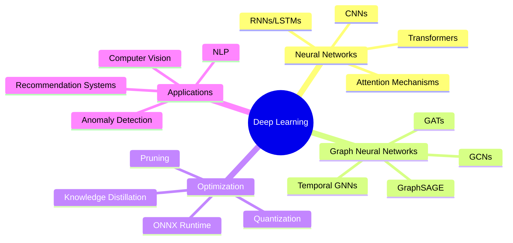

<div align="center">

# 👋 Hi, I'm Abransh Baliyan

[](https://git.io/typing-svg)

### 🚀 Passionate about Deep Learning, Neural Networks, and Building Scalable AI Systems

</div>

---

## 🧠 About Me

I'm a **Deep Learning Engineer** and **Full-Stack Developer** with a strong focus on neural networks, AI systems, and deep tech. My journey began with **C++** and a fascination with physics, which evolved into a passion for understanding how neural networks process information and building AI-powered applications at scale.

Currently diving deep into:
- 🔬 **Neural Network Architectures** - CNNs, RNNs, Transformers, and their applications
- 🕸️ **Graph Neural Networks (GNNs)** - Exploring spatial and spectral approaches
- 🤖 **Large Language Models (LLMs)** - Fine-tuning, prompt engineering, and integration
- ⚡ **High-Performance Computing** - Optimizing AI inference and training pipelines
- 🏗️ **AI System Architecture** - Building scalable, production-ready ML systems

```python
class Abransh:
    def __init__(self):
        self.role = "Deep Learning Engineer & Full-Stack Developer"
        self.location = "Milan, Italy 🇮🇹"
        self.education = "Computer Engineering @ Politecnico di Milano"
        self.current_focus = ["Neural Networks", "GNNs", "Deep Tech", "AI Systems"]
        self.interests = ["Physics", "Mathematics", "Distributed Systems", "AI Research"]
    
    def current_projects(self):
        return {
            "JobSwipe": "AI-powered job automation with 99.9% accuracy",
            "Deep Learning": "Exploring GNN architectures for complex data",
            "AI Systems": "Building scalable ML inference pipelines"
        }
```

---

## 🔬 Deep Learning & AI

### Core Expertise
- **Neural Network Fundamentals**: Backpropagation, Gradient Descent, Optimization Algorithms
- **Architectures**: CNNs, RNNs, LSTMs, GRUs, Transformers, Attention Mechanisms
- **Graph Neural Networks**: GCNs, GATs, GraphSAGE, Message Passing Neural Networks
- **Computer Vision**: Image Classification, Object Detection, Semantic Segmentation
- **Natural Language Processing**: Text Classification, Named Entity Recognition, Sequence-to-Sequence Models
- **Model Optimization**: Quantization, Pruning, Knowledge Distillation, ONNX Runtime

### AI/ML Tech Stack

<div align="center">


</div>

---

## 💻 Technical Arsenal

### Languages
<div align="center">


</div>

### Backend & APIs
<div align="center">


</div>

### Frontend & Mobile
<div align="center">


</div>

### Databases & ORMs
<div align="center">


</div>

### Cloud & DevOps
<div align="center">


</div>

### Message Queues & Real-time
<div align="center">


</div>

### Authentication & Security
<div align="center">


</div>

---

## 🚀 Featured Projects

### 🤖 [JobSwipe](https://github.com/Abransh) - AI Job Application Automation
> **Tech**: Next.js, TypeScript, Node.js, PostgreSQL, Prisma, OpenAI API, Browser Automation

- 🎯 **99.9% accuracy** in automated job applications using AI agents
- 🔄 Reverse-engineered major ATS platforms (Greenhouse, Lever) for API integration
- 📄 Built sophisticated PDF-to-HTML conversion system with pixel-perfect formatting
- 🤖 AI-powered resume editing that preserves formatting while enabling intelligent modifications
- ⚡ Processes 100+ applications per day with automated form filling and document submission

### 💬 [Chatify](https://github.com/Abransh) - Real-time Messaging Platform
> **Tech**: React, TypeScript, WebSockets, Node.js, PostgreSQL, Redis

- 🔴 Real-time messaging with **WebSocket** connections supporting 1K+ concurrent users
- 🎤 Voice channels and screen sharing using **WebRTC**
- ⚡ **Redis** for caching and pub/sub messaging patterns
- 🎨 Discord-inspired UI with modern design achieving **95+ Lighthouse score**

### 🧭 NAVIGO - Tourist Guide Platform
> **Tech**: React, Node.js, Express, MongoDB, Google Maps API

- 🗺️ Tourist-guide matching platform serving travelers in Milan
- 📍 Real-time geolocation and intelligent matching algorithms
- 🏗️ Scalable backend handling **10K+ daily requests**
- 👥 Led technical team of 4 engineers as CTO

---

## 📊 GitHub Analytics

<div align="center">


</div>

<div align="center">


</div>

<div align="center">


</div>

---

## 🏆 GitHub Trophies

<div align="center">

[](https://github.com/ryo-ma/github-profile-trophy)

</div>

---

## 📚 Currently Learning & Researching



### 📖 Current Focus Areas:
- 🧠 **Graph Neural Networks**: Spatial vs Spectral approaches, Message Passing frameworks
- 🔬 **Neural Architecture Search**: AutoML and efficient architecture design
- ⚡ **Model Optimization**: Inference optimization, quantization techniques
- 🏗️ **MLOps**: Building production-grade ML pipelines at scale
- 📊 **Distributed Training**: Multi-GPU and distributed deep learning

---

## 🌟 What Drives Me

> *"The beauty of neural networks lies not just in their ability to learn, but in how they mirror the fundamental patterns of nature itself."*

From my early fascination with **physics** to exploring the mathematics behind **neural networks**, I'm driven by understanding how systems learn and adapt. Whether it's the backpropagation algorithm or the message-passing mechanism in GNNs, I find elegance in the mathematics that powers modern AI.

### My Philosophy:
- 🔬 **Deep Understanding** over surface-level implementation
- 🏗️ **Build to Scale** - production-ready, not just prototypes
- 🤝 **Collaborate & Learn** - best ideas emerge from diverse perspectives
- 🎯 **Impact First** - technology should solve real problems

---

## 📫 Let's Connect!

<div align="center">

[](https://linkedin.com/in/abransh-baliyan)
[](https://github.com/Abransh)
[](mailto:your.email@example.com)
[](https://your-portfolio.com)
[](https://twitter.com/yourusername)

</div>

---

<div align="center">

### 💡 Open to collaborating on:
Deep Learning Research | AI System Architecture | Open Source ML Tools | Graph Neural Networks

### 🎯 Interested in:
Full-time opportunities in AI/ML Engineering | Deep Learning Research | Backend Engineering | Startup Ventures

---


**⭐️ From [Abransh](https://github.com/Abransh) | Building the future, one neural network at a time**

</div>
