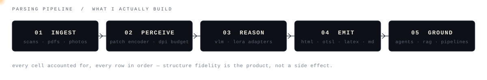

<div align="center">
  
</div>

<div align="center">
  <sub>
    <a href="https://infratex.io"><b>infratex.io</b></a> &nbsp;·&nbsp;
    <a href="https://www.linkedin.com/in/abransh-baliyan/">linkedin</a> &nbsp;·&nbsp;
    <a href="mailto:abranshbaliyan2807@gmail.com">email</a> &nbsp;·&nbsp;
    Milan, Italy
  </sub>
</div>

<br>

I work on the unglamorous half of AI: getting real documents — scanned annual accounts, credit agreements, 40-year-old faxes — into a form a model can actually reason over without inventing a number. Started with deterministic geometry over glyphs, ended up training vision-language models after roughly seventy conversations with people whose job depends on this working.

Before that: C++, physics, and writing backprop from scratch in NumPy because reading about it wasn't enough.

<br>

## › now

**Founder & CEO at [Infratex](https://infratex.io)** — document extraction and context infrastructure for LLMs and agents. Proprietary VLM parsing pipeline, paying customers in EU financial services, currently the sharp end of every technical decision I make.

**Research:** whether adapting a vision encoder during VLM fine-tuning helps or hurts depends on how well the *output format* is supported in pretraining — HTML and Markdown versus OTSL and permuted controls. Hash-locked protocol, pre-registered difference-in-differences endpoint. Writing it up for a NeurIPS workshop, then journal.

**Also:** evaluating early-stage deals at Titan Capital, and losing to better pilots in War Thunder.

<br>

## › what I build

<div align="center">
  
</div>

The interesting failures live at stage 04. A model can score beautifully on structure metrics while quietly dropping half the content — which is a benchmark problem as much as a model problem, and is roughly what my current paper argues.

<br>

## › selected work

| | | |
|---|---|---|
| **Infratex parsing engine** | VLM pipeline: page → faithful structured output, built for agent consumption | production, paying customers |
| **Format × encoder ablation** | Does output-format pretraining support mediate vision-encoder adaptation? Six-format ladder, pre-registered endpoint | paper in progress |
| **Biaffine formula extraction** | Transformer over glyph graphs, seven directed relation types, supervision derived from SyncTeX-aligned arXiv sources | research |
| **Glyph point-cloud layout** | 600K-parameter DGCNN classifying regions from raw glyph geometry — no rasterization | research |
| **Hybrid retrieval stack** | Dense + BM25 + LLM tree search, RRF fusion, cross-encoder rerank, late-interaction visual arm | production |
| **JobSwipe** | Job application automation — Playwright, Fastify, reverse-engineered ATS flows | earlier work |

<!-- Add a benchmark line here once you've settled the exact defensible wording. -->

<br>

## › tools I actually reach for

```
modelling     pytorch · transformers · peft · ms-swift · vllm
              lora/qlora · rlvr · gspo · quantization

documents     vit patch encoders · otsl · teds · dgcnn
              layout detection · synthetic corpora · ocr-free parsing

retrieval     hybrid dense+bm25 · rrf fusion · cross-encoder rerank
              colpali-lineage late interaction · grounding gates

systems       typescript · python · c++ · fastify · fastapi
              postgres · redis · docker · github actions

infra         multi-gpu training · inference optimization · onnx
```

Everything above is something I've shipped or trained with, not something I've read the docs for.

<br>

## › signals

<div align="center">
  
  
</div>

<div align="center">
  
</div>

<div align="center">
  
</div>

<br>

## › open to

Deep collaborations on document AI, structured extraction, and evaluation methodology that actually measures fidelity. If you have a corpus that breaks every parser you've tried, I'd like to see it.

<div align="center">
  <br>
  <sub><code>abransh</code> &nbsp;·&nbsp; built in milan</sub>
</div>
