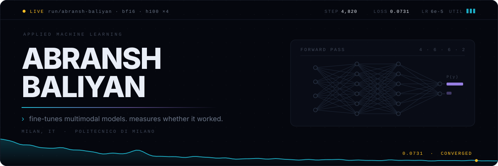
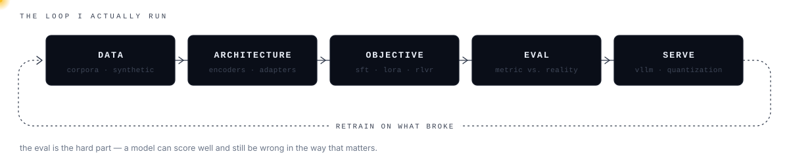
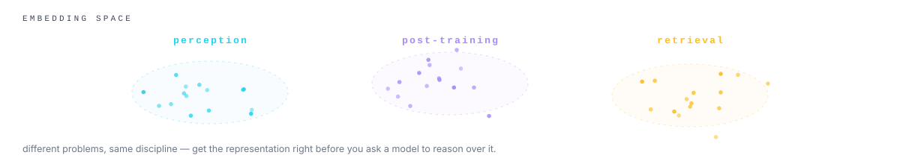

<div align="center">
  
</div>

<div align="center">
  <sub>
    <a href="https://www.linkedin.com/in/abransh-baliyan/">linkedin</a> &nbsp;·&nbsp;
    <a href="mailto:abranshbaliyan2807@gmail.com">email</a> &nbsp;·&nbsp;
    <a href="https://infratex.io">infratex.io</a> &nbsp;·&nbsp;
    Milan, Italy
  </sub>
</div>

<br>

I train models. Mostly multimodal ones, and mostly on problems where the benchmark and the actual requirement have quietly drifted apart.

Started with C++, physics, and writing backprop from scratch in NumPy because reading about it wasn't enough. That's still the through-line: vision encoders, LoRA/QLoRA and RLVR post-training, quantized multi-GPU serving — and a stubborn interest in whether the metric a model scores well on measures the thing anyone actually cares about.

<br>

## › now

**Research.** Whether adapting a vision encoder during VLM fine-tuning helps or hurts turns out to depend on how well the *output format* was supported in pretraining. Six-format ladder, hash-locked protocol, pre-registered difference-in-differences endpoint — so the result can't be talked into existing after the fact. Writing it up for a NeurIPS workshop, then journal.

**Production.** Multimodal models serving live traffic in EU financial services. Real latency budgets, real failure modes, real people who notice when a number is wrong.

**Otherwise.** Reading training logs at unreasonable hours, and losing to better pilots in War Thunder.

<br>

<div align="center">
  
</div>

<br>

## › selected work

<div align="center">
  
</div>

| | | |
|---|---|---|
| **Encoder adaptation × output format** | Does unfreezing the vision encoder during VLM fine-tuning help? Conditioned on how well the target format was supported in pretraining. Six-format ladder, pre-registered endpoint | paper in progress |
| **Biaffine relation transformer** | Transformer over graph-structured input, seven directed relation types, supervision derived programmatically from aligned source pairs | research |
| **Point-cloud region classifier** | 600K-parameter DGCNN over raw 2-D geometry — no rasterization, no CNN, no pixels at any point | research |
| **Multimodal retrieval stack** | Dense + BM25 with RRF fusion, cross-encoder rerank, late-interaction visual arm in the ColPali lineage | production |
| **Post-training & serving** | LoRA/QLoRA, RLVR, GSPO, AWQ/GPTQ quantization, multi-GPU training, vLLM inference | production |
| **Backprop from scratch** | NumPy, no autograd. The reason none of the above is a black box to me | where it started |

<br>

## › what I reach for

```
training      pytorch · transformers · peft · trl · ms-swift · deepspeed
              lora/qlora · rlvr · gspo · dpo · mixed precision

multimodal    vit patch encoders · late interaction · dgcnn
              geometry & layout models · synthetic corpora · ocr-free

serving       vllm · onnx · awq/gptq · continuous batching
              multi-gpu · inference profiling · kv-cache budgeting

evaluation    pre-registered protocols · ablation design · teds
              structure-aware metrics · failure taxonomies

systems       python · typescript · c++ · fastapi · fastify
              postgres · redis · docker · github actions
```

Everything above is something I've trained, shipped, or broken in production — not something I've read the docs for.

<br>

## › signals

<div align="center">
  
  
</div>

<!--
  ─────────────────────────────────────────────────────────────────────────
  WAKATIME — uncomment once set up (~5 min), then replace WAKA_USERNAME
    1. sign up at https://wakatime.com  (GitHub login works)
    2. install the WakaTime plugin in your editor (VS Code: "WakaTime")
    3. Settings → uncheck "Hide coding activity from public profile"
    4. your username is in the URL of https://wakatime.com/@<username>
  ─────────────────────────────────────────────────────────────────────────
<div align="center">
  
</div>
-->

<div align="center">
  
</div>

<div align="center">
  
</div>

<!--
  ─────────────────────────────────────────────────────────────────────────
  SPOTIFY NOW-PLAYING — uncomment once set up (~5 min), then replace SPOTIFY_UID
    1. go to https://spotify-github-profile.kittinanx.com/
    2. "Sign in with Spotify" and authorize
    3. it hands you a UID — copy it into both places below
  ─────────────────────────────────────────────────────────────────────────
<div align="center">
  <a href="https://open.spotify.com/user/SPOTIFY_UID">
    
  </a>
</div>
-->

<br>

## › open to

Deep collaborations on multimodal modelling, post-training, and evaluation methodology that measures fidelity instead of vibes. If you have a task where every model you've tried scores well and is still wrong, I'd like to see it.

<div align="center">
  <br>
  <sub><code>abransh</code> &nbsp;·&nbsp; built in milan</sub>
</div>
